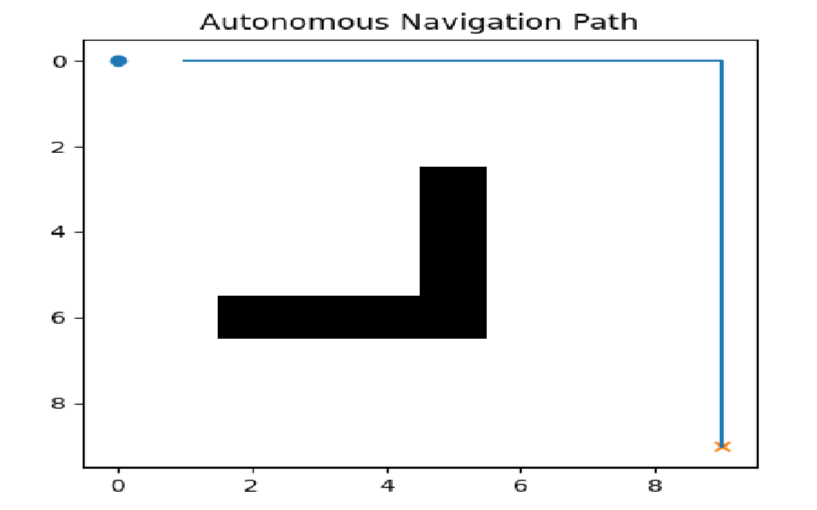
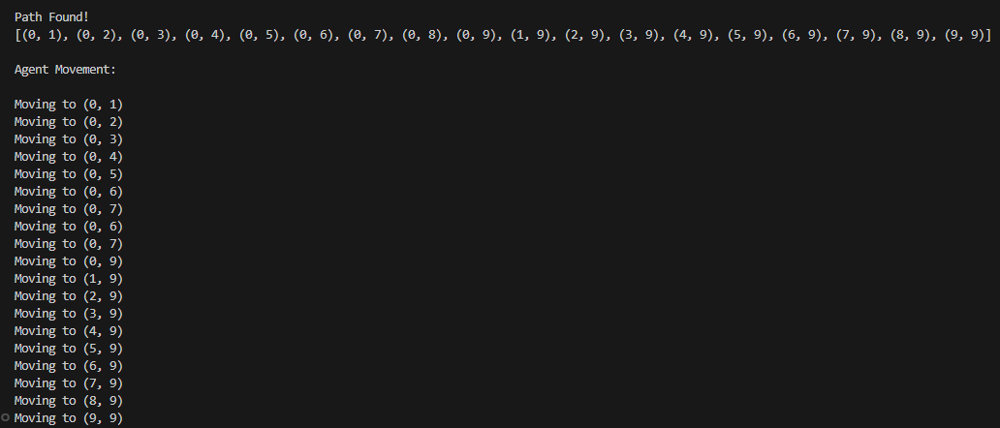
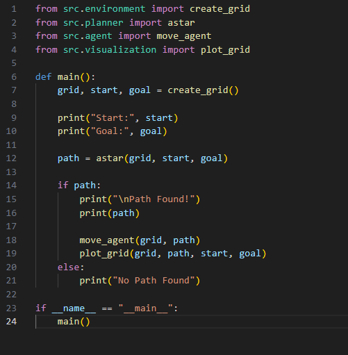

🚗 AI-Based Autonomous Navigation System
📌 Project Overview
This project simulates an AI-based autonomous navigation system that can find the shortest path from a start point to a goal while avoiding obstacles using the A* algorithm.

🎯 Problem Statement
Autonomous systems like self-driving cars and robots need to navigate safely in environments with obstacles.
This project demonstrates how path planning algorithms can solve this problem.

🧠 Features
A* Path Planning Algorithm
Obstacle Avoidance
Grid-based Simulation
Visualization of navigation path
Step-by-step agent movement

🛠 Tech Stack
Python
NumPy
Matplotlib
OpenCV

🏗 Project Structure
AI-Autonomous-Navigation-System/
│
├── src/
├── outputs/
│   └── images/
├── main.py
├── requirements.txt
└── README.md

▶️ How to Run
Run the following commands inside the project folder:

pip install -r requirements.txt
python main.py

## 📸 Outputs

### 🧭 Path Visualization

---

### 💻 Terminal Output

---

### 🧾 Code Snapshot

🚀 Future Improvements
Real-time camera input
Integration with simulation tools like CARLA
Deep learning-based object detection
Multi-agent navigation

🎓 Learning Outcomes
Understanding A* algorithm
Working with grid-based simulations
Visualization using Matplotlib
Basic robotics navigation logic

👩‍💻 Author
Nidhi Apotikar

